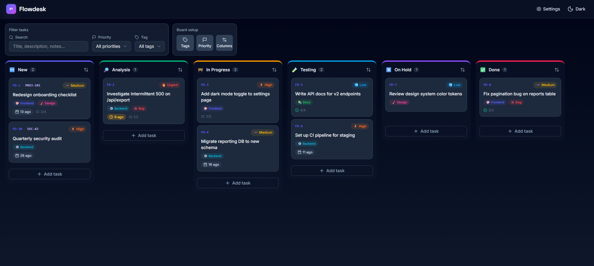
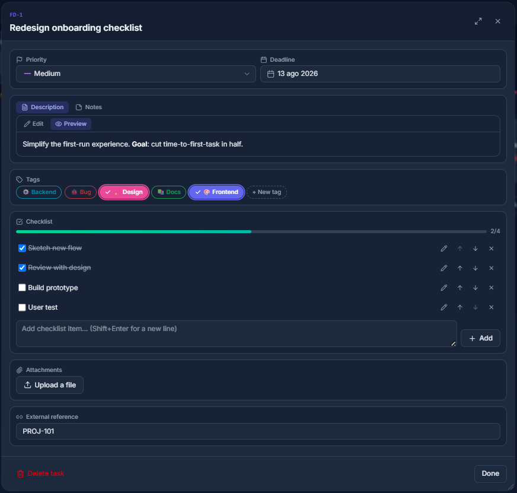

#  Flowdesk


Flowdesk is a local-only, self-hosted Kanban board for tracking your own
work. It runs entirely on your machine, with no accounts and no cloud, and
stores everything in a single SQLite file.

## Preview

<p align="center">
  <br>
  <sub>The board — columns, drag-and-drop cards, filters</sub>
</p>
<p align="center">
  <br>
  <sub>Task detail — description, tags, checklist, attachments</sub>
</p>

## Features

- Drag-and-drop board with fully customizable columns
- Tasks with Markdown description/notes (bold, italic, underline, color),
  status, priority, deadline, tags, checklist, and file attachments
- Move a task between columns by dragging it or from the Status dropdown in
  its detail window
- Task edits are saved only when you press Save; closing with unsaved changes
  asks for confirmation
- Per-column auto-sort by priority or deadline, in either direction
- Search and filter by text, priority, or tag
- Draggable, resizable, maximizable windows for tasks and settings
- Light and dark theme
- Manual backup export/restore

## Project structure

```
run.py                     Entrypoint: python run.py
requirements.txt           Backend dependencies
backend/app/
  main.py                  FastAPI app, mounts routers + static files
  models.py                SQLAlchemy models
  schemas.py               Pydantic request/response schemas
  database.py              Engine/session setup, additive schema sync
  routers/                 One module per resource (columns, tasks, tags, ...)
  services/                Business logic used by the routers
  static/                  Built frontend (generated, gitignored)
backend/tests/             Pytest suite (temp SQLite per test)
frontend/src/
  api/                     Typed fetch wrappers per resource
  components/              Board, task, and shared UI components
  components/ui/           Small design-system primitives (Button, Badge, Card)
  hooks/                   Reusable stateful logic (async actions, floating panels, ...)
  lib/                     Shared frontend utilities (e.g. `cn` for class merging)
  pages/                   BoardPage, SettingsPage
  state/                   Theme and board-data React contexts
data/                      SQLite database, backups, attachments (gitignored)
```

## Requirements

- Python 3.12+
- Node.js 20+ (build-time only; not required to run the app)

## Setup

```bash
python -m venv .venv
.venv\Scripts\activate      # Windows
source .venv/bin/activate   # macOS/Linux

pip install -r requirements.txt

cd frontend
npm install
npm run build
cd ..
```

`npm run build` compiles the frontend into `backend/app/static/`, served
directly by FastAPI. This is a one-time (or per-update) step.

## Running

```bash
python run.py
```

Starts the server at `http://127.0.0.1:8000` and opens it in your browser.
It binds to `127.0.0.1` only — never reachable from other devices.

## Data & backups

All data lives in `data/`, excluded from git:

- `data/flowdesk.db` — the SQLite database
- `data/backups/` — backups exported from the Settings page
- `data/attachments/` — files uploaded to tasks

## Development

```bash
uvicorn backend.app.main:app --reload   # backend, auto-reload
npm run dev                             # frontend dev server (from frontend/)
```

The Vite dev server proxies `/api` to `http://127.0.0.1:8000`.

To retake the screenshots above with fictional data instead of your real
board, run `python demo/serve_demo.py` — it serves an isolated, seeded-once
demo database on `http://127.0.0.1:8010` and never touches `data/`.

## Testing & linting

```bash
pytest                              # backend tests
ruff check backend run.py           # backend lint
npm run lint                        # frontend lint (from frontend/)
```
